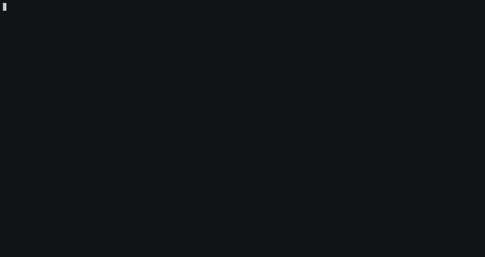

# VR Viewport Prediction

## Preparing Dataset

- Copy 5 videos to `datasets/videos/` directory

  ```sh
  $ tree datasets/videos
  datasets/videos
  ├── video_01.mp4
  ├── video_01_subtitle_original.srt
  ├── video_01_subtitle.srt
  ├── video_02.mp4
  ├── video_02_subtitle_original.srt
  ├── video_02_subtitle.srt
  ├── video_03.mp4
  ├── video_03_subtitle_original.srt
  ├── video_03_subtitle.srt
  ├── video_04.mp4
  ├── video_04_subtitle_original.srt
  ├── video_04_subtitle.srt
  ├── video_05.mp4
  ├── video_05_subtitle_original.srt
  └── video_05_subtitle.srt

  0 directories, 15 files
  ```

- Run `./scripts/preprocess_collected_data.py --all` to extract video frames and
  preprocess head orientation log, subtitles.
- Run `./scripts/extract_ground_truth_saliency_maps.py` to extract ground-truth
  saliency maps.

## Evaluating Models



```sh
$ poetry shell
$ vp -h
usage: viewport_prediction [-h] -m MODEL_NAME -c FILE [-v]

Run experiment

options:
  -h, --help            show this help message and exit
  -m MODEL_NAME, --model MODEL_NAME
                        Model name ['ieee2020']
  -c FILE, --config FILE
                        Config file location
  -v, --version         Print version info

$ vp -c ./config/ieee2020.toml -m ieee2020
```

## Convention

### Spherical Coordinates


The position of a point is specified by a tuple of ($\theta$, $\phi$, $r$),
where:

- $0 \le \theta \le \pi$ denotes the _inclination_ angle in radians from the
  positive $z$-axis
- $0 \le \phi \le 2\pi$ denotes the counterclockwise _azimuth_ angle in the
  $x$-$y$ plane measured in radians from the positive $x$-axis
- $r$ represents _radius_.

## TODO

- [x] Refactor code
- [ ] Disable reshuffle on val & test datasets
- [ ] Add dataset for Seq2Seq-based models
- [ ] Add models
  - [ ] MM2018
  - [ ] Sensors2022 (Head orientation + Saliency + Subtitle features)
- [ ] Quaternion
